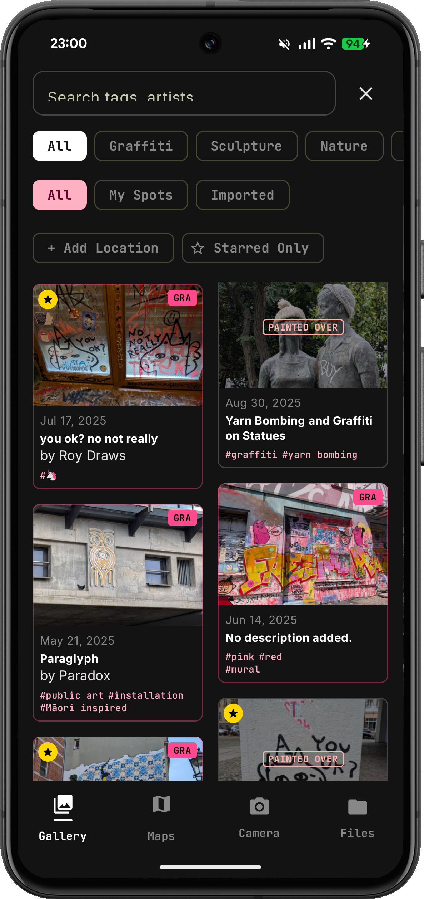
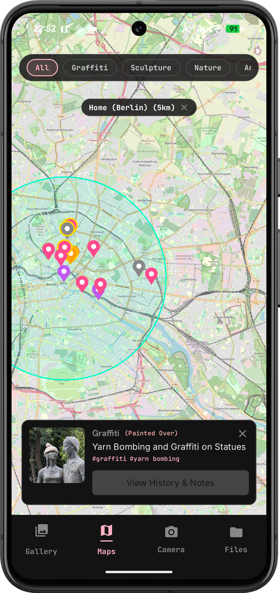
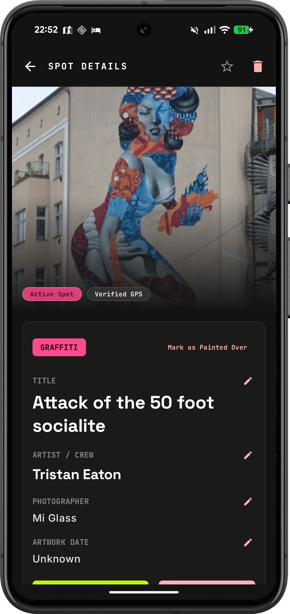
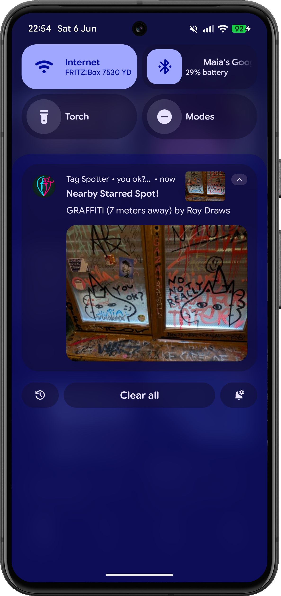

# Tag Spotter

An Android application designed for city walkers to capture, tag, and geolocate urban street art and graffiti.

```
          +-------------------------------------------------+
          |                   TagSpotter                    |
          +-------------------------------------------------+
          |                                                 |
          |  [ Bottom Navigation ]                          |
          |  ├── [ Gallery ]   --> Grid of captured spots   |
          |  ├── [ Map ]       --> OSM Map with neon pins   |
          |  └── [ Camera ]    --> Live Capture / Photo     |
          |  └── [ File ]      --> Load from Gallery        |
          |                                                 |
          |  [ Capture / Import Screen ]                    |
          |  └── [ Detail & Tagging Screen ]                |
          |      ├── Auto GPS (from GPS or EXIF metadata)   |
          |      ├── Description & Artist inputs            |
          |      ├── Predefined Tag Chips (#mural, etc.)    |
          |      └── Recent Custom Tag Suggestions          |
          |                                                 |
          +-------------------------------------------------+
```

## Screenshots

|                Gallery                 |              Map               |                Detail                |                   Notification                   |
|:--------------------------------------:|:------------------------------:|:------------------------------------:|:------------------------------------------------:|
|  |  |  |  |

## Features

- **Local-First & Privacy-Focused**: Stores all information locally on-device. No accounts, API keys, or cloud storage required by default.
- **Vibrant Urban Dark Theme**: Designed with a sleek, high-contrast dark palette with neon green, cyan, and hot pink accents.
- **Multiple Capture Flows**:
  - **Live Camera**: Built on CameraX, capturing images and automatically fetching GPS location.
  - **Gallery Import**: Uses modern Android Photo Picker for zero-permission photo selection and extracts GPS coordinates from image EXIF metadata.
- **Interactive Offline-Ready Map**: Powered by OpenStreetMap (OSMDroid) to show tags as custom pins, with fading pins to track erased tags historically.
- **Flexible Tagging & Logging**: Annotate spots with descriptions, artists, custom tags, or single-tap quick tags.
- **Database & Storage**: Optimized Room database containing:
  - `spots`: Coordinates, metadata, and status.
  - `spot_images`: Links to localized pictures.
  - `spot_notes`: History log for tracking how graffiti spots evolve or disappear.

## Tech Stack

- **Language**: Kotlin
- **UI Framework**: Jetpack Compose with Material 3
- **Navigation**: Jetpack Navigation 3 (Type-safe with Kotlinx Serialization)
- **Local DB**: Room (SQLite)
- **Map Engine**: OpenStreetMap (OSMDroid)
- **Image Loading**: Coil
- **Camera API**: Jetpack CameraX

## Getting Started

### Prerequisites

- Android Studio Koala+ or Command Line Tools.
- Android SDK 34+.

### Build & Run

### Android

To build the debug APK:
```bash
./gradlew :androidApp:assembleDebug
```

To install and run the Android app on a connected device/emulator:
```bash
./gradlew :androidApp:installDebug
adb shell am start -n net.maiatoday.tagspotter/net.maiatoday.tagspotter.feature.main.MainActivity
```

To run Android unit tests:
```bash
./gradlew :androidApp:testDebugUnitTest
```

### iOS

To build and run the iOS app on an iOS Simulator:

1. **Start the Simulator**:
   ```bash
   open -a Simulator
   ```
   If needed, boot a specific simulator (e.g. iPhone 17):
   ```bash
   xcrun simctl boot "iPhone 17"
   ```

2. **Build the App**:
   Specify `ONLY_ACTIVE_ARCH=YES ARCHS=arm64` to match the simulator architecture and align with the KMP Gradle project target configurations:
   ```bash
   xcodebuild -project iosApp/iosApp.xcodeproj \
              -scheme iosApp \
              -configuration Debug \
              -sdk iphonesimulator \
              -derivedDataPath build/ios \
              ONLY_ACTIVE_ARCH=YES \
              ARCHS=arm64 \
              build
   ```

3. **Install the App**:
   ```bash
   xcrun simctl install booted build/ios/Build/Products/Debug-iphonesimulator/iosApp.app
   ```

4. **Launch the App**:
   ```bash
   xcrun simctl launch booted net.maiatoday.iosApp
   ```

### Unit Tests
To run all unit tests across the multiplatform modules:
```bash
./gradlew test
```

## License

This project is licensed under the MIT License. See the [LICENSE](LICENSE) file for details.
