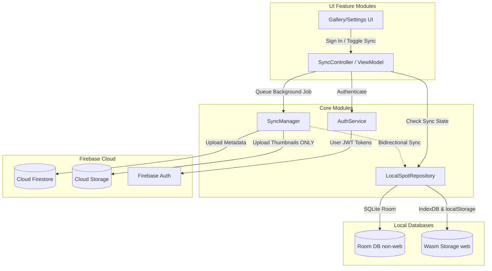

# Optional Firebase Login & Cloud Sync Integration Plan

This document details the architectural design and technical steps for implementing **Optional Firebase Authentication & Cloud Sync** in the Tag Spotter Kotlin Multiplatform (KMP) application across all platforms (Android, iOS, Desktop, and Web/Wasm).

It incorporates all aligned design decisions from our interactive alignment sessions to ensure a cost-efficient, offline-first, and highly reliable synchronization experience.

---

## Aligned Design Decisions

During our interactive alignment sessions, we finalized the following core behaviors:

1.  **Desktop Target Auth**: Since native Google Sign-In SDKs are not natively supported on Desktop targets, we will support **Email & Password** as the fallback authentication method on Desktop (JVM), while utilizing native **Google Sign-In** on mobile (Android/iOS) and web (Wasm).
2.  **Initial Merging**: When signing in for the first time on a device with existing data, the app will execute a **Bidirectional Merge**. It will automatically upload local spots and download cloud spots, using **Last-Write-Wins (LWW)** based on high-precision `lastEditedAt` timestamps for conflict resolution.
3.  **Deletion Synchronization**: Deletions will be handled via **Soft Deletes**. When a spot is deleted, its `status` is set to `"deleted"` (or `"erased"`) and its `lastEditedAt` is updated. This allows the deletion state to naturally propagate to other devices during standard sync comparisons without needing separate tombstone tables.
4.  **Cloud Storage Optimization**: To minimize Firebase Storage storage and bandwidth costs, **only thumbnails are uploaded and synced to Cloud Storage**. Full-size high-fidelity photos remain strictly local to the device where they were originally taken or imported from a `.ts_pack`.
5.  **Logout Behavior**: When logging out of a Firebase account, the app will **Retain Local Data**. All spots, thumbnails, and notes remain fully intact on the local device, and the app simply halts background synchronization and goes back to standard offline operation.
6.  **Web (Wasm) Storage Relationship**: On the Web (Wasm) target, we will employ a **Local-First Cache** approach. We will keep using browser `localStorage` and `IndexedDB` as the primary datastores for instant UI rendering (0ms latency), syncing changes with Firestore in the background.
7.  **Synchronization Scheduling & Frequency**: We will implement a **Reactive & Real-time** sync schedule. Local changes are synced instantly to Firebase as soon as they are saved, and the app utilizes Firestore's real-time snapshot listeners to download cloud changes instantly.
8.  **Active Edit Conflict Priority**: If the user is actively editing a spot on the `DetailScreen` (keyboard focused or text selection is active) and a real-time cloud update for that spot is received, the app will **pause cloud overrides for that specific spot** until the user leaves the screen or saves. This avoids jarring text updates, cursor jumps, or lost edits.

---

## Shared Attribution & Overlapping Location Sync Strategy

To address advanced street art photography workflows—specifically when multiple distinct artworks exist at the exact same physical coordinates, or when spots originate from different photographers:

### 1. Option A: Unified Cloud Sync with Strict Read-Only Lock
When a user has active cloud synchronization, their database may contain spots they created as well as shared "foreign" spots imported from other photographers' `.ts_pack` archives:
*   **Unified Backup Decision**: We will sync **all spots** (both self-authored and imported) to the user's private Firebase Cloud store. This ensures a 100% complete backup of their curated collection, restoring shared spots seamlessly on any newly synced device.
*   **The Strict Lock**: If the spot has `isImported == true` (or the `photographerUuid` does not match the active device's `myPhotographerUuid`), **the entire spot is completely locked from any edits**:
    *   **No Metadata Changes**: Editing the photographer, description, artists, category, status, tags, or artwork date is strictly blocked.
    *   **No Photo Changes**: Users cannot add new photos or delete existing photos on someone else's spot.
    *   **No Note Changes**: Adding, editing, or deleting notes is disabled.
    *   **Visual Cue**: The UI will prominently display a read-only badge indicating the spot's original photographer and lock down all interactive input triggers.
*   **Photographer UUID Collision Protection**: To protect against display name collisions (e.g., two independent users both choosing the handle "Alice"), we generate a persistent `photographerUuid` locally on the device when the name is first created in Settings.
    *   All newly logged spots store both `photographerName` and `photographerUuid`.
    *   When importing a `.ts_pack`, the importer compares `importedSpot.photographerUuid` against our own `myPhotographerUuid` instead of comparing display names.
    *   If they are different, the spot is marked `isImported = true` (read-only), even if both display names are exactly "Alice".


### 2. Precise Deduplication & Overlapping Location Support
To prevent incorrect merges of different graffiti works, murals, or changing exhibitions created on the same wall or in the same public square:
*   **UUID Priority**: If two spots already have different `uuid` values, they are **always treated as distinct records and are never merged**, regardless of how close they are in latitude and longitude.
*   **Legacy Heuristic (Without UUIDs)**: For legacy Version 1 `.ts_pack` imports that lack UUIDs, we completely eliminate coordinate-based merging to avoid false positives. Instead, we use a high-fidelity **exact-session match rule**:
    *   We **only** merge an imported non-UUID spot with a local spot if they share the **exact same `createdAt` timestamp** (which represents the identical logging session).
    *   If their `createdAt` timestamps differ, they represent distinct logging sessions (e.g., different paintings on the same wall over time). The importer will generate a unique `uuid` for the imported spot, treat it as new, and preserve both overlapping records.

---

## Login UI & User Experience (UX) Design

To fit our premium aesthetic guidelines, the login flow will be integrated seamlessly with a responsive, modern glassmorphic look.

### 1. Settings Entry Point & Sync Banner
*   **Offline State**: In the `SettingsScreen` (and optionally as a top banner in the Gallery), we display an elegant card: **"Backup your spots to the Cloud"**.
    *   *Design*: Sleek dark background with a subtle linear gradient (deep indigo to purple) and a glowing "Sync" cloud icon.
    *   *Call-to-Action*: A prominent **"Sign In to Sync"** glassmorphic button.
*   **Online/Synced State**: Once logged in, the card transforms to show:
    *   User's profile details (Email or name, and avatar/initials badge).
    *   **Live Sync Status indicator**: A small flashing green dot with text `"Live Sync Active"`, along with the last sync timestamp.
    *   A clean **"Sign Out"** outline button.

### 2. Adaptive Auth Dialog (`AuthDialog`)
When tapping "Sign In", a Compose Multiplatform dialog opens. The interface adapts based on the client platform:

#### Mobile (Android / iOS) & Web (Wasm)
*   Displays a beautiful, brand-compliant **"Sign In with Google"** button with a white/colored Google "G" icon and rounded corners.
*   Includes a secondary button: `"Use Email/Password instead"` to slide open a standard form.

#### Desktop (JVM Fallback)
*   Since native Google Sign-In is unavailable on JVM out of the box, the dialog defaults directly to an **Email & Password form**:
    *   **Input Fields**: Two rounded text fields with floating labels (`"Email Address"`, `"Password"`).
    *   **Action button**: Deep purple button `"Sign In"`.
    *   **Toggle link**: `"Don't have an account? Sign Up"`, which smoothly transitions the action button to `"Create Account"` with a micro-animation.

### 3. Cross-Provider Credential Linking (Google Mobile to Desktop Fallback)
If a user registers initially using **Google Sign-In** on mobile or web and subsequently opens the app on **Desktop** (where Google Sign-In is not supported), they will not have a password configured on their account. We handle this seamlessly via **Firebase Credential Linking**:

*   **Self-Service Password Creation**: 
    1.  The user inputs their Google email address (e.g., `user@gmail.com`) on Desktop and clicks **"Forgot Password? / Create Desktop Password"**.
    2.  Firebase Authentication sends a standard **Password Reset Email** to their inbox.
    3.  Tapping the link allows them to safely establish a password for their account.
    4.  Once set, they can sign in on Desktop with their email and password.
    5.  Firebase Auth automatically **links the Email/Password credential to their Google Sign-In record** under the same account. The user now has a single unified cloud backup folder, accessible via Google Sign-In on mobile/web and Email/Password on Desktop.

### 4. Automatic Session Persistence (Zero-friction Re-entry)
The user will **not** need to sign in every time they open the application (including on Desktop).
*   **Persistent Caching**: The Firebase Auth SDK automatically caches and encrypts the user's login session on the device's secure local keychain/storage.
*   **Silent Restoration**: On application startup, the `AuthService` checks for a cached user session (`currentUserFlow.first()`). If detected, the app restores the session silently, updates the sync indicators, and automatically resumes real-time synchronization in the background without any user interaction or login dialog popups.
*   **Background Token Refresh**: Firebase automatically manages short-lived token refreshing (JWTs valid for 1 hour are silently refreshed using long-lived refresh tokens) completely invisibly to the user.

### 5. Photographer Profile & Unique Handle Prompting Flow
To solve the issue of unassigned or mismatched photographer names, we will establish a unified, proactive profile setup flow:

*   **Offline Mode (Local Prompts)**:
    *   If the user has **not** configured a photographer name in Settings and attempts to create their first spot (or goes to Settings), we will display a soft, elegant banner or inline tooltip: *"Add a photographer name to claim credit for your spots. We recommend choosing a unique handle/pseudonym."*
*   **On First Cloud Sign-In**:
    1.  **Cloud Check**: When a user logs in for the first time on any device, the system queries Firestore `/users/{uid}/profile`.
    2.  **Profile Download (Existing Cloud Profile)**: If a profile document is found, we automatically download and sync the `photographerName` to local Settings. (This guarantees that signing in on Desktop JVM instantly syncs the user's correct photographer handle from their mobile device with zero manual typing!).
    3.  **Handle Confirmation (New Cloud Profile)**: If no cloud profile document exists yet:
        *   We pull their local photographer name if they had set one.
        *   If the local setting is empty, we auto-hydrate a tentative default using their **Google account display name** (e.g. "Jane Doe") or their **Email local part** (e.g. "jane.doe" from `jane.doe@gmail.com`).
        *   We display a beautiful, modern **"Set your Photographer Profile"** card inside the onboarding sync flow, giving them a chance to confirm or customize their handle before commencing their first cloud sync.
        *   Upon confirmation, we write this profile document to Firestore at `/users/{uid}/profile` to lock in their single-source-of-truth profile.

---

## Technical Architecture Overview

To preserve our local-first offline capabilities, the application remains fully functional without an internet connection or logged-in account. Data sync is triggered as a reactive, optional background sync layer once a user chooses to log in.



---

## Sequenced Implementation Phases

To ensure a smooth, risk-free development cycle, the technical implementation is divided into **five sequential, independent phases**:

```mermaid
gantt
    title Development Sequence
    dateFormat  YYYY-MM-DD
    section Backend
    Phase 1: DB Schema & Models         :active, p1, 2026-06-16, 2d
    section Migration
    Phase 2: Legacy Backup Versioning   : p2, after p1, 2d
    section Platform Setup
    Phase 3: Firebase Client Setup      : p3, after p2, 2d
    section Core Sync
    Phase 4: AuthService & SyncManager  : p4, after p3, 3d
    section UI Integration
    Phase 5: Optional Auth UI & Locking : p5, after p4, 2d
```

### Phase 1: Database Schema & Model Hydration (Local-First Foundation)
Before initiating any network integrations, we must ensure all local storage systems support the required metadata tracking.
*   [ ] Modify domain models (`Spot`, `SpotImage`, `SpotNote`) to include `uuid` and `lastEditedAt`.
*   [ ] Increment `@Database` version inside `SpotDatabase.kt` (Room).
*   [ ] Create Room automated migration queries to add columns with safe default values.
*   [ ] Update `WasmSpotRepository` map stores and `localStorage` JSON mapping to handle `uuid` and `lastEditedAt`.
*   [ ] Update all database write operations (editing description, status, stars, etc.) to automatically refresh `lastEditedAt` to the current system time.

### Phase 2: Legacy Backup (`.ts_pack`) Upgrade & Deduplication Logic
Update local archive routines to handle the database schema shift gracefully and protect existing users from duplicate spots.
*   [ ] Implement the `BackupWrapper` (V2) container in Kotlinx Serialization.
*   [ ] Update `MultiplatformPackExporter` to bundle output within `BackupWrapper` with `backupVersion = 2`.
*   [ ] Update `MultiplatformPackImporter` parsing:
    *   If no wrapper (V1): Populate new `uuid` on the fly, set `lastEditedAt = createdAt`, and apply the **exact-session match rule** (matching `createdAt` timestamps exactly).
    *   If wrapper is V2: Direct lookup by `uuid` and resolve conflict via LWW.

### Phase 3: Firebase Platform Configs & SDK Dependency Setup
Provide platform SDK links across the multi-module project structure.
*   [ ] Register GitLive dependencies and version variables in `libs.versions.toml`.
*   [ ] Setup the `:core:sync` multiplatform library module.
*   [ ] **Android**: Inject `google-services.json` and apply the Gradle plugin.
*   [ ] **iOS**: Add the native Swift Firebase SDK Package in Xcode and import `GoogleService-Info.plist`.
*   [ ] **Web (Wasm)**: Place compat Firebase CDN scripts and `initializeApp` inside `index.html`.

### Phase 4: Core Authentication & Reactive Synchronization Layer
Implement the platform-agnostic client sync routines.
*   [ ] Write `AuthService` wrapping Google Sign-In (mobile/web) and Email/Password (desktop JVM fallback).
*   [ ] Develop the bidirectional `SyncManager`:
    *   **Pull stage**: Firestore snapshot listener queries remote records modified since last sync time. Updates Room/Web DB using LWW.
    *   **Push stage**: Query database for locally modified (`isSynced = false`) items. Push metadata to Firestore.
    *   **Storage stage**: Upload spot thumbnails to Cloud Storage if they do not exist, keeping full-size photos completely local.

### Phase 5: Optional Auth UI, Settings, and Focus Locking
Expose the cloud sync controls to the user while preserving the edit workflow UX.
*   [ ] Add a **"Sync & Backup"** toggle and login form to SettingsScreen (dynamically switching between Google Sign-In on mobile/web and Email/Password forms on Desktop).
*   [ ] Map local-to-cloud bidirectional merging upon the user's first successful sign-in.
*   [ ] Implement **Local Active Write Priority**: Add focus/editing checks inside `DetailViewModel`. If the spot is actively being edited, defer incoming background real-time sync overrides until focus is cleared.

---

## Installation & Dependency Setup

We will leverage the multiplatform **GitLive Firebase Kotlin SDK**, which wraps native Firebase SDKs on Android and iOS, and interacts with JS Firebase libraries on Web/Wasm, allowing us to write idiomatic common Kotlin code.

### 1. Version Catalogs (`libs.versions.toml`)

Add the following versions and libraries to your [libs.versions.toml](file:///Users/maia/workspace/maiatoday/tag-spotter/gradle/libs.versions.toml) file:

```toml
[versions]
firebase-kotlin-sdk = "2.1.0"
google-services = "4.4.2"

[libraries]
firebase-auth = { module = "dev.gitlive:firebase-auth", version.ref = "firebase-kotlin-sdk" }
firebase-firestore = { module = "dev.gitlive:firebase-firestore", version.ref = "firebase-kotlin-sdk" }
firebase-storage = { module = "dev.gitlive:firebase-storage", version.ref = "firebase-kotlin-sdk" }

[plugins]
google-services = { id = "com.google.gms.google-services", version.ref = "google-services" }
```

### 2. Common Gradle Setup (`:core:sync`)

In your new `:core:sync` module's `build.gradle.kts`, add the GitLive dependencies directly to the `commonMain` source set:

```kotlin
kotlin {
    sourceSets {
        commonMain.dependencies {
            implementation(projects.core.model)
            implementation(projects.core.database)
            implementation(libs.firebase.auth)
            implementation(libs.firebase.firestore)
            implementation(libs.firebase.storage)
            implementation(libs.kotlinx.coroutines.core)
        }
    }
}
```

### 3. Platform-Specific Configurations

#### Android App Setup
1. Apply the Google Services plugin inside your [androidApp/build.gradle.kts](file:///Users/maia/workspace/maiatoday/tag-spotter/androidApp/build.gradle.kts):
   ```kotlin
   plugins {
       alias(libs.plugins.google.services)
   }
   ```
2. Place the downloaded `google-services.json` inside your `androidApp/` directory.

#### iOS App Setup
1. In Xcode, select your `iosApp` project, navigate to **File > Add Package Dependencies...**, and add the official iOS Firebase SDK:
   `https://github.com/firebase/firebase-ios-sdk`
2. Select **FirebaseAuth**, **FirebaseFirestore**, and **FirebaseStorage** products to link with your runner application.
3. Drag and drop your downloaded `GoogleService-Info.plist` file into your Xcode project hierarchy.

#### Web (WASM) Setup
1. In your web runner's [index.html](file:///Users/maia/workspace/maiatoday/tag-spotter/webApp/src/wasmJsMain/resources/index.html), add the standard Firebase CDN scripts inside your `<head>` block before your main app compiles:
   ```html
   <script src="https://www.gstatic.com/firebasejs/10.12.0/firebase-app-compat.js"></script>
   <script src="https://www.gstatic.com/firebasejs/10.12.0/firebase-auth-compat.js"></script>
   <script src="https://www.gstatic.com/firebasejs/10.12.0/firebase-firestore-compat.js"></script>
   <script src="https://www.gstatic.com/firebasejs/10.12.0/firebase-storage-compat.js"></script>
   
   <script>
     const firebaseConfig = {
       apiKey: "YOUR_API_KEY",
       authDomain: "YOUR_PROJECT_ID.firebaseapp.com",
       projectId: "YOUR_PROJECT_ID",
       storageBucket: "YOUR_PROJECT_ID.appspot.com",
     };
     firebase.initializeApp(firebaseConfig);
   </script>
   ```

---

## Proposed Changes

### Component 1: Core Domain Models (`:core:model`)

We will modify domain model classes to include global unique identifiers, sync tracking, and edit auditing metadata.

#### [MODIFY] [Spot.kt](file:///Users/maia/workspace/maiatoday/tag-spotter/core/model/src/commonMain/kotlin/net/maiatoday/tagspotter/core/model/Spot.kt)
*   **`Spot`**:
    *   Add `val uuid: String = generateUuid()`
    *   Add `val photographerUuid: String = ""`
    *   Add `val lastEditedAt: Long = createdAt` (Epoch milliseconds of last modification)
    *   Add `val isSynced: Boolean = false`
*   **`SpotImage`**:
    *   Add `val uuid: String = generateUuid()`
    *   Add `val lastEditedAt: Long = timestamp`
*   **`SpotNote`**:
    *   Add `val uuid: String = generateUuid()`
    *   Add `val lastEditedAt: Long = timestamp`

---

### Component 2: Database Schema & Migrations (`:core:database`)

#### [MODIFY] [SpotEntity.kt](file:///Users/maia/workspace/maiatoday/tag-spotter/core/database/src/nonWebMain/kotlin/net/maiatoday/tagspotter/core/database/SpotEntity.kt)
*   Add `uuid`, `photographerUuid`, `lastEditedAt`, and `isSynced` columns to `SpotEntity`.
*   Add `uuid` and `lastEditedAt` to `SpotImageEntity` and `SpotNoteEntity`.
*   Create an index on the `uuid` column in all three tables for high-performance lookups during synchronization.
*   Update database mapper extensions (`toDomain()` / `toEntity()`) to propagate these new properties.

#### [MODIFY] [SpotDatabase.kt](file:///Users/maia/workspace/maiatoday/tag-spotter/core/database/src/nonWebMain/kotlin/net/maiatoday/tagspotter/core/database/SpotDatabase.kt)
*   Increment the `@Database` version number.
*   Define a Room migration path (Auto-migration or automated SQL script) to add columns with default values (`isSynced` defaults to `0`, `uuid` is generated dynamically, and `lastEditedAt` defaults to the existing `createdAt` value).
*   *SQL Script representation:*
    ```sql
    ALTER TABLE spots ADD COLUMN uuid TEXT NOT NULL DEFAULT '';
    ALTER TABLE spots ADD COLUMN lastEditedAt INTEGER NOT NULL DEFAULT 0;
    ALTER TABLE spots ADD COLUMN isSynced INTEGER NOT NULL DEFAULT 0;
    ```

#### [MODIFY] [WasmSpotRepository.kt](file:///Users/maia/workspace/maiatoday/tag-spotter/core/database/src/wasmJsMain/kotlin/net/maiatoday/tagspotter/core/database/WasmSpotRepository.kt)
*   Update internal map layouts to handle the added properties.
*   Synchronize `lastEditedAt` updates automatically on every `updateSpot...` or status modification method.

---

### Component 3: Backup Export & Import Upgrades (`:core:database`)

We must version the `.ts_pack` backup structure to support smooth legacy imports without data loss.

#### [MODIFY] [MultiplatformPackImporter.kt](file:///Users/maia/workspace/maiatoday/tag-spotter/core/database/src/nonWebMain/kotlin/net/maiatoday/tagspotter/core/database/MultiplatformPackImporter.kt)
*   Introduce a `BackupWrapper` data class to wrap exported ZIP contents:
    ```kotlin
    @Serializable
    data class BackupWrapper(
        val backupVersion: Int = 2,
        val spots: List<SpotDetails>
    )
    ```
*   **Version 1 (Legacy Import)**: If the JSON is directly a raw list of `SpotDetails` (lacking metadata wrap and UUIDs):
    *   Iterate over items, trigger exact-session timestamp match rule (matching `createdAt` timestamp exactly).
    *   If distinct, generate random UUIDs and assign `lastEditedAt = createdAt`.
*   **Version 2 (Modern Import)**: If parsed wrapper contains `backupVersion = 2`:
    *   Match by `uuid`.
    *   Perform LWW (Last-Write-Wins) timestamp comparisons against local records.

---

### Component 4: Firebase Abstraction Layer (`:core:sync`)

We will introduce a platform-agnostic sync and auth module to bridge local repositories with Firebase.

#### [NEW] [AuthService.kt](file:///Users/maia/workspace/maiatoday/tag-spotter/core/sync/src/commonMain/kotlin/net/maiatoday/tagspotter/core/sync/AuthService.kt)
*   Interface wrapping optional login flows:
    ```kotlin
    interface AuthService {
        val currentUserFlow: Flow<FirebaseUser?>
        suspend fun signInWithGoogle(): Result<Unit>
        suspend fun signInWithEmailAndPassword(email: String, password: String): Result<Unit>
        suspend fun signUpWithEmailAndPassword(email: String, password: String): Result<Unit>
        suspend fun signOut()
    }
    ```

#### [NEW] [SyncManager.kt](file:///Users/maia/workspace/maiatoday/tag-spotter/core/sync/src/commonMain/kotlin/net/maiatoday/tagspotter/core/sync/SyncManager.kt)
*   Coordinates online sync:
    1.  **Pull Phase**: Query Firestore path `/users/{uid}/spots` where `lastEditedAt > localLastSyncTime`. Apply LWW to update local DB.
    2.  **Push Phase**: Retrieve local spots where `isSynced = false`. Upload metadata to Firestore.
    3.  **Blob Storage Phase**: Iterate through images. Upload **thumbnail files ONLY** to Firebase Storage path `users/{uid}/thumbnails/{uuid}.jpg` if missing. Update local sync state. Full-size images are kept strictly local.

---

## Firebase Configuration & Security Rules

To enforce privacy, users must only have read/write access to their own data directory.

### Firestore Security Rules
```javascript
rules_version = '2';
service cloud.firestore {
  match /databases/{database}/documents {
    match /users/{userId}/{document=**} {
      allow read, write: if request.auth != null && request.auth.uid == userId;
    }
  }
}
```

### Firebase Storage Security Rules
```javascript
rules_version = '2';
service firebase.storage {
  match /b/{bucket}/o {
    match /users/{userId}/{allPaths=**} {
      allow read, write: if request.auth != null && request.auth.uid == userId;
    }
  }
}
```

---

## Verification Plan

### Automated Tests
1.  **Deduplication & Conflict Resolution Tests**:
    *   Verify that importing a spot with an identical `uuid` but an *older* `lastEditedAt` does not overwrite the local spot.
    *   Verify that importing identical `uuid` with a *newer* `lastEditedAt` successfully overwrites.
    *   Test exact-session timestamp match rule by importing non-UUID spots with matching exact `createdAt` timestamps and verify they are correctly merged rather than duplicated. Verifying that matching GPS but different timestamps does NOT merge.
2.  **Legacy Backup Translation Tests**:
    *   Parse a raw V1 `spots.json` list, verify it compiles, populates UUIDs, and stores them correctly.

### Manual Verification
1.  **Local-First Verification**:
    *   Ensure the application is fully functional offline with zero setup. Create spots, take photos, and edit notes.
2.  **Optional Sign-In & Sync**:
    *   Go to Settings, choose **Sign in with Google** (mobile/web) or **Sign in with Email** (Desktop).
    *   Verify that all offline-created spots instantly sync to Firestore and their thumbnail attachments upload to Cloud Storage.
3.  **Cross-Device Live Updating**:
    *   Sign in on an Android device and a Web tab using the same account.
    *   Create a spot on the web tab; verify it renders on the Android device's gallery in real-time.
