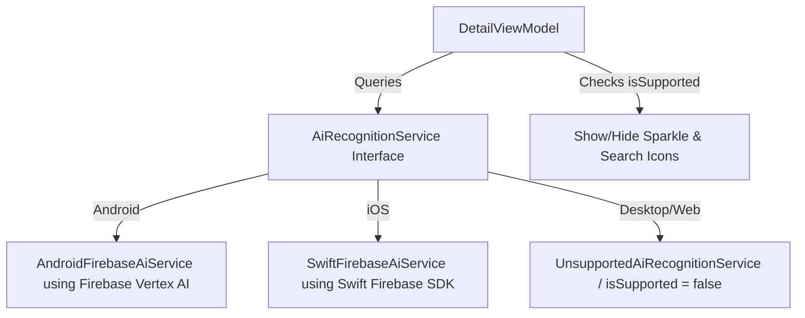
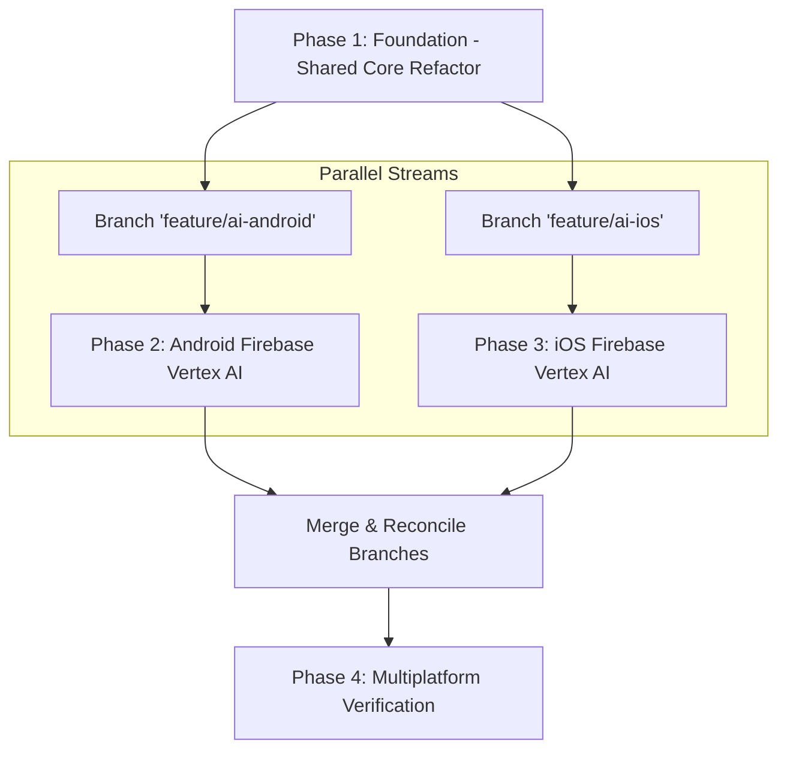

# Securing Gemini API with Firebase & AI Lookups

This implementation plan details how we will securely manage the Gemini API key using Firebase Vertex AI on Mobile platforms (Android & iOS), while gracefully disabling all AI features on non-mobile platforms (Desktop/JVM and Web/Wasm).

---

## Aligned Design Decisions (Grill-Me Finalized)

1. **Mobile-Exclusive AI Support**: AI features (identify artist and Wikipedia lookup) will be **exclusive** to Mobile platforms (Android & iOS).
2. **Remove Desktop & Web AI**: AI support is completely removed from Desktop/JVM and Web/Wasm. 
   - No Gemini API Key input fields will be shown in Settings on any platform anymore.
   - Sparkle (identify artist) and Wikipedia search icons are completely hidden on Desktop and Web/Wasm.
3. **Clean Platform Support Check**: We will add a read-only `isSupported: Boolean` property to the `AiRecognitionService` interface:
   - On Android and iOS implementations, it will return `true`.
   - On other platforms, it will return `false`.
   - `DetailViewModel` will use this property to dynamically compute AI availability in the UI.
4. **Unsupported Platform Bound Class**: For Desktop and Web/Wasm, we will create a clean `UnsupportedAiRecognitionService` class implementing `AiRecognitionService` that returns `isSupported = false` and returns null or throws an error if called.
5. **Testing Mocks (`FakeAiRecognitionService`)**: We will update the test double `FakeAiRecognitionService` with a mutable `var isSupported: Boolean = true` property. This allows tests to cleanly verify behaviors for both active and inactive AI support conditions.
6. **Firebase Vertex AI only**: Because mobile is the sole target, we will rely exclusively on Google's official **Firebase Vertex AI** SDK on Android and Swift's **FirebaseVertexAI** library on iOS. No manual client-side API keys or local settings inputs will exist.
7. **App Check Setup**: Firebase App Check with the Debug Provider will be enabled automatically in code for debug builds to streamline local development, and production setup (Play Integrity and App Attest) will be documented.
8. **Architectural Decoupling**: The `AiRecognitionService` interface will not take an `apiKey` parameter. The platform implementations (Android and iOS) connect directly via the Firebase SDKs.

---

## Proposed Architectural Simplification

With Desktop and Web AI support removed, the architecture becomes incredibly streamlined:
- We remove all Gemini API Key settings properties and input fields from the application.
- `DetailViewModel` simply asks `AiRecognitionService` to perform operations, without needing to resolve or pass any keys.
- We add `val isSupported: Boolean` to `AiRecognitionService`.
- On Android, `AndroidFirebaseAiService` implements `AiRecognitionService` using the Firebase SDK (`isSupported = true`).
- On iOS, `SwiftFirebaseAiService` implements `AiRecognitionService` using the Swift Firebase SDK (`isSupported = true`).
- On Desktop/Web, we inject an `UnsupportedAiRecognitionService` (`isSupported = false`).



---

## Proposed Changes

### Component 1: Interface & Core UI Fallback

#### [MODIFY] [AiRecognitionService.kt](file:///Users/maia/workspace/maiatoday/tag-spotter/core/ai/src/commonMain/kotlin/net/maiatoday/tagspotter/core/ai/AiRecognitionService.kt)
- Remove `apiKey` parameter from both functions.
- Add `val isSupported: Boolean` property.
  ```kotlin
  interface AiRecognitionService {
      val isSupported: Boolean
      
      suspend fun identifyArtist(
          imagePath: String,
          category: String,
          currentArtist: String? = null,
          currentTitle: String? = null,
          thumbnailPath: String? = null
      ): AiSuggestion?
      
      suspend fun searchWikipediaForSpot(title: String, category: String, artists: List<String>): String?
  }
  ```

#### [NEW] [UnsupportedAiRecognitionService.kt](file:///Users/maia/workspace/maiatoday/tag-spotter/core/ai/src/commonMain/kotlin/net/maiatoday/tagspotter/core/ai/UnsupportedAiRecognitionService.kt)
- Implement `AiRecognitionService` with `isSupported = false`. Methods can return `null` or throw `UnsupportedOperationException`.

#### [MODIFY] [FakeAiRecognitionService.kt](file:///Users/maia/workspace/maiatoday/tag-spotter/core/ai/src/commonMain/kotlin/net/maiatoday/tagspotter/core/ai/FakeAiRecognitionService.kt)
- Add `override var isSupported: Boolean = true` implementation and remove any legacy parameters matching `apiKey`.

#### [MODIFY] [DetailViewModel.kt](file:///Users/maia/workspace/maiatoday/tag-spotter/feature/detail/src/commonMain/kotlin/net/maiatoday/tagspotter/feature/detail/DetailViewModel.kt)
- Remove manual key resolution and parameters from `aiRecognitionService` calls.
- Update `isAiAugmentationAvailable` StateFlow logic:
  ```kotlin
  val isAiAugmentationAvailable: StateFlow<Boolean> = settingsRepository.artistRecognitionEnabled
      .map { enabled -> enabled && aiRecognitionService.isSupported }
      .stateIn(
          scope = viewModelScope,
          started = SharingStarted.WhileSubscribed(5000),
          initialValue = false
      )
  ```

#### [MODIFY] [SettingsScreen.kt](file:///Users/maia/workspace/maiatoday/tag-spotter/feature/settings/src/commonMain/kotlin/net/maiatoday/tagspotter/feature/settings/SettingsScreen.kt)
- Completely remove the "Gemini API Key" input text field from all platforms.

---

### Component 2: Android Native Firebase Integration

#### [MODIFY] [libs.versions.toml](file:///Users/maia/workspace/maiatoday/tag-spotter/gradle/libs.versions.toml)
- Define Firebase BOM, Vertex AI, and App Check dependencies.

#### [MODIFY] [build.gradle.kts (Android app)](file:///Users/maia/workspace/maiatoday/tag-spotter/androidApp/build.gradle.kts)
- Apply the Google Services plugin and link Firebase libraries.

#### [NEW] [AndroidFirebaseAiService.kt](file:///Users/maia/workspace/maiatoday/tag-spotter/core/ai/src/androidMain/kotlin/net/maiatoday/tagspotter/core/ai/AndroidFirebaseAiService.kt)
- Implement `AiRecognitionService` using Google's official `com.google.firebase.vertexai` SDK (`isSupported = true`).

---

### Component 3: iOS Native Firebase Integration

#### [NEW] [SwiftFirebaseAiService.swift](file:///Users/maia/workspace/maiatoday/tag-spotter/iosApp/iosApp/SwiftFirebaseAiService.swift)
- Swift implementation using official `FirebaseVertexAI` CocoaPod/Swift Package (`isSupported = true`).

#### [MODIFY] [iOSApp.swift](file:///Users/maia/workspace/maiatoday/tag-spotter/iosApp/iosApp/iOSApp.swift)
- Register the native Swift implementation into the shared Koin container during startup.

---

## Parallel Execution Topology

Since Phase 2 (Android) and Phase 3 (iOS) are fully decoupled once the shared API interface is established, they can be developed **in parallel** on isolated branches/workspaces, then merged back.



---

## Backend & Firebase Configuration (Manual vs. Automated)

While we can run local setup commands using the Firebase CLI, Google Cloud API enablement and project app registration must be performed on the Firebase/GCP Console.

### Required Actions on Firebase Console:
1. **Enable Vertex AI in Firebase**: Go to the Firebase Console -> Build -> **Vertex AI** and click **Get Started**. (This enables the underlying Google Cloud `firebasevertexai.googleapis.com` API).
2. **Register Apps**: Register your Android App Package (`net.maiatoday.tagspotter`) and iOS App Bundle ID under the Firebase Project settings.
3. **Download Config Files**: Download and save:
   - `google-services.json` (for Android)
   - `GoogleService-Info.plist` (for iOS)
4. **App Check Setup**:
   - Go to Build -> **App Check**.
   - Register **Play Integrity** for Android and **App Attest / DeviceCheck** for iOS.
   - For local development, generate **App Check Debug Tokens** in the console and configure them on your test devices/simulators.

---

## Slicable Execution Phases & Subagent Prompts

### Phase 1: Foundation (Shared Core Refactor)
*Must be completed first to establish the service contracts.*
- **Scope**:
  - Remove `apiKey` parameter from `AiRecognitionService` interface.
  - Add `val isSupported: Boolean` to `AiRecognitionService`.
  - Implement `UnsupportedAiRecognitionService` on common/unsupported directories and bind it in Koin on non-mobile platforms.
  - Simplify `DetailViewModel` by removing key resolution and updating `isAiAugmentationAvailable` using the new `isSupported` property.
  - Update `FakeAiRecognitionService` and fix all common compilation and test failures.
  - Remove "Gemini API Key" from `SettingsScreen.kt` on all targets.

---

### Phase 2: Android Native Firebase Integration (Parallel Stream)
*Execute in a clean workspace branch: `feature/ai-android`.*

#### 🚀 Subagent Launch Prompt for Phase 2:
```text
You are a specialized Android Engineer subagent tasked with integrating Google Firebase Vertex AI and App Check on Android.

CONTEXT & PREREQUISITES:
- Phase 1 foundation is complete. The AiRecognitionService interface no longer requires an apiKey.
- You must work in a clean workspace branched from main (feature/ai-android).

TASKS:
1. Update dependency configurations:
   - Add Firebase BOM, Firebase Vertex AI, and Firebase App Check dependencies to gradle/libs.versions.toml.
   - Apply 'com.google.gms.google-services' and 'com.google.firebase.appcheck' plugins to the androidApp/build.gradle.kts.
2. Implement the Android Service:
   - Create core/ai/src/androidMain/kotlin/net/maiatoday/tagspotter/core/ai/AndroidFirebaseAiService.kt.
   - Implement AiRecognitionService using com.google.firebase.vertexai.vertexAI.
   - Set isSupported = true.
3. Bind the Service:
   - Update Koin setup in the Android-specific entrypoint to inject AndroidFirebaseAiService instead of UnsupportedAiRecognitionService.
4. App Check Debug Setup:
   - Initialize Firebase App Check in the Android application class using DebugAppCheckProviderFactory.
5. Verify build correctness for Android target.

Deliver a clean PR style summary of modified files, and do not merge yet.
```

---

### Phase 3: iOS Native Firebase Integration (Parallel Stream)
*Execute in a clean workspace branch: `feature/ai-ios`.*

#### 🚀 Subagent Launch Prompt for Phase 3:
```text
You are a specialized iOS Engineer subagent tasked with integrating Google Firebase Vertex AI and App Check on iOS.

CONTEXT & PREREQUISITES:
- Phase 1 foundation is complete. The AiRecognitionService interface no longer requires an apiKey.
- You must work in a clean workspace branched from main (feature/ai-ios).

TASKS:
1. Update Xcode Project Dependencies:
   - Add FirebaseVertexAI and FirebaseAppCheck packages using Swift Package Manager (SPM) inside iosApp/iosApp.xcodeproj.
2. Implement Swift AI Service:
   - Create iosApp/iosApp/SwiftFirebaseAiService.swift.
   - Implement the AiRecognitionService interface using Swift's native FirebaseVertexAI library.
   - Set isSupported = true.
3. Bind Service via Koin:
   - During iOS startup, register SwiftFirebaseAiService into the shared Koin container using Koin Swift helper declarations.
4. App Check Debug Setup:
   - Initialize App Check in iOSApp.swift using AppCheckDebugProviderFactory.
5. Verify compile correctness on iOS simulator.

Deliver a clean PR style summary of modified files, and do not merge yet.
```

---

## Phase 4: Merge & Multiplatform Verification
- **Scope**:
  - Merge branches `feature/ai-android` and `feature/ai-ios` into the main line, resolving any Koin/dependency declaration conflicts.
  - Verify that the app builds successfully on all targets (Android, iOS, Desktop, Web/Wasm).
  - Confirm the Settings UI does not show the API key field anywhere.
  - Verify that AI lookup is gracefully hidden on Desktop and Web, and completely functional on iOS and Android simulators with debug tokens configured.
