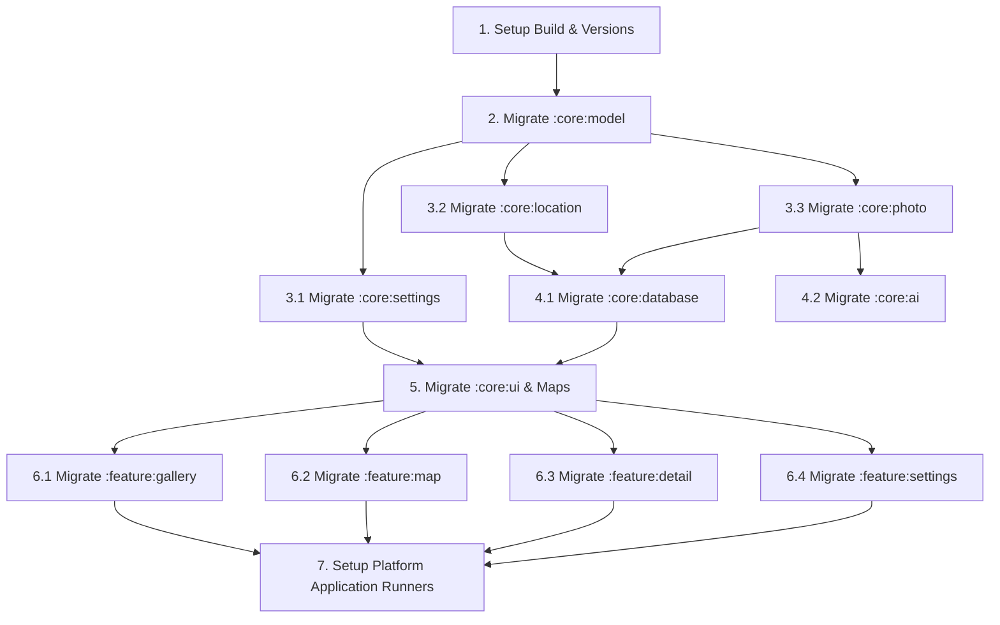

# Kotlin Multiplatform (KMP) Migration Plan

This document outlines the architectural changes, transition strategy, recommended libraries, and a step-by-step parallel execution plan for migrating the Tag Spotter codebase from an Android-only multi-module project to a Kotlin Multiplatform (KMP) application supporting iOS, Android, Desktop, and Web.

---

## 1. Required Architectural Changes

To transition Tag Spotter to a Kotlin Multiplatform app while retaining full Android support (including the Wear OS app), the project structure must evolve from an Android-centric module hierarchy to a multiplatform module hierarchy.

### Module Reorganization (AGP 9.0 & JetBrains KMP Default Structure)
Following the JetBrains default project structure and AGP 9.0 requirements, the entry-point modules must be separated from library/logic modules:
1.  **Rename `:app` to `:androidApp`**: This module remains Android-only, containing the Android-specific entry point (`MainActivity`, `TagSpotterApplication`), Android manifest, and specific resources.
2.  **Convert Shared Modules to KMP Library Modules**: Keep the existing modular design (`:core:*` and `:feature:*`) but apply the `kotlin("multiplatform")` plugin to each. This permits each module to compile for Android, iOS, JVM (Desktop), and Web (Wasm/JS).
3.  **Preserve `:wear` as Android-only**: The Wear OS companion app will remain Android-only and compile directly against the Android targets (`androidMain` artifacts) of the shared `:core transition targets`.
4.  **Add New App Modules**:
    *   `:desktopApp` (JVM runner using Compose HTML/Desktop)
    *   `:webApp` (Kotlin/Wasm target runner)
    *   `iosApp` (Xcode project wrapper utilizing Swift/SwiftUI to load the shared Compose UI framework)

### Architecture Diagram (Target State)
```
                                +-----------------------------------+
                                |             :wear                 | (Android Wear OS App)
                                +-----------------+-----------------+
                                                  |
                                                  v (Android dependency target)
+-----------------------------------------------------------------------------------+
| Multiplatform Shared Modules (:core, :feature)                                    |
|                                                                                   |
|  +--------------------+  +--------------------+  +---------------------+          |
|  |   :feature:gallery |  |   :feature:map     |  |   :feature:detail   | ...      | (Compose MP)
|  +---------+----------+  +---------+----------+  +----------+----------+          |
|            |                       |                        |                     |
|            +-----------------------+------------------------+                     |
|                                    | (depends on)                                 |
|                                    v                                              |
|  +-----------------------------------------------------------------------------+  |
|  |   :core:ui (Typography, category styling, themes)                           |  | (Compose MP)
|  +---------------------------------+-------------------------------------------+  |
|                                    |                                              |
|                                    v                                              |
|  +---------+  +---------+  +---------+  +---------+  +---------+  +---------+     |
|  |:core:db |  |:core:loc|  |:core:pho|  |:core:set|  |:core:ai |  |:core:mod|     | (KMP libraries)
|  +---------+  +---------+  +---------+  +---------+  +---------+  +---------+     |
+------------------------------------+----------------------------------------------+
                                     ^
       +-----------------+-----------+-----------+-----------------+
       |                 |                       |                 |
       v                 v                       v                 v
+--------------+  +--------------+        +--------------+  +--------------+
|  :androidApp |  |  :desktopApp |        |    iosApp    |  |   :webApp    | (Platform Runners)
|  (Android)   |  |     (JVM)    |        | (Swift/Xcode)|  |  (Kotlin/Wasm|
+--------------+  +--------------+        +--------------+  +--------------+
```

### Expect/Actual Abstraction Boundaries
Several modules consume APIs that do not have pure Kotlin representations. We must inject these or define `expect`/`actual` interfaces:
*   **Database Builder**: `:core:database` must resolve a platform-specific file path/factory for the SQLite database.
*   **Location Provider**: `:core:location` must define a common interface that interacts with Play Services (Android), CoreLocation (iOS), Geolocation API (Web), and mock coordinates (Desktop).
*   **Photo Processing & Camera**: `:core:photo` and Camera interfaces must remove dependencies on `android.graphics.Bitmap` and Android's `Uri`, substituting platform-agnostic byte arrays, common resources, or Compose `ImageBitmap` objects.
*   **Maps Overlay**: `:core:ui` 's `OsmMapView` (using OSMDroid) is Android-specific. We must abstract this with an `expect fun MapView(...)` or custom map implementations for iOS, Desktop, and Web.

---

## 2. Transition Strategy & Library Recommendations

Migrating incrementally prevents large, uncompilable code blocks and permits testing at every step. We recommend starting with leaf modules (no dependencies) and proceeding upwards.

### Library Recommendations (Klibs/Multiplatform Ecosystem)

| Current Library (Android/JVM) | KMP Recommended Replacement | Rationale |
| :--- | :--- | :--- |
| **Room Database** | **Room KMP (2.7.0+)** | Room has official first-party KMP support for Android, iOS, and JVM. |
| **EncryptedSharedPreferences** | **Multiplatform Settings** (Russhwolf) | Standard KMP library. Automatically binds to `EncryptedSharedPreferences` on Android and `Keychain` on iOS. |
| **Google Play Services Location** | **Expect/Actual** or **Compass** (MapLibre KMP) | Simplifies retrieval of latitude/longitude with fallback to platform-native location services. |
| **Coil 2 (Image Loading)** | **Coil 3 (KMP)** | Coil 3 has fully integrated multiplatform support including asset management and custom memory caching. |
| **Generative AI SDK (Google)** | **Ktor Client** + REST API or **Generative AI KMP SDK** | Making HTTP calls using Ktor simplifies JSON payload building and keeps the dependencies lightweight. |
| **OSMDroid (Map)** | **Compose Multiplatform Map** or Native Wrappers | Use OSMDroid on Android via `AndroidView`; native `MapKit` on iOS via `UIKitView`; Leaflet inside WebViews or static map fallbacks for Desktop and Web. |
| **Android Jetpack Navigation 3** | **Jetpack Navigation 2.8+ (KMP)** | AndroidX Navigation 2.8+ officially supports Kotlin Multiplatform. |
| **JUnit 4 / JUnit Jupiter** | **kotlin.test** | Out-of-the-box multiplatform test assertions compiling across all targets. |
| **Koin (Android)** | **Koin Core / Koin Compose** | Fully KMP compatible, providing ViewModels and dependency injection across all platforms. |
| **Kotlin DataStore** | **DataStore KMP (1.1.0+)** | Jetpack DataStore has official Multiplatform support (using platform-specific file system directories). |
| **AndroidX Exifinterface** | **Ashampoo Kim (KMP)** | Common KMP EXIF library for reading metadata directly from images in `commonMain`. |

---

## 3. Step-by-Step Implementation Plan

Tasks are divided into sequential preparation steps followed by parallelisable module migrations.



### Stage A: Foundation (Sequential)
These tasks must occur first to set up the build environment.

- [ ] **Task A1: Gradle & Version Catalog Setup**
  - Update `gradle/libs.versions.toml` to declare Compose Multiplatform, Kotlin Multiplatform, and Room/Settings KMP dependencies.
  - Configure root `build.gradle.kts` with KMP plugins: `kotlin("multiplatform")` and `id("org.jetbrains.compose")`.
- [ ] **Task A2: Migrate `:core:model`**
  - Change plugin to `kotlin("multiplatform")` in `core/model/build.gradle.kts`.
  - Declare common target platforms. Move source code from `src/main/java` to `src/commonMain/kotlin`.
  - Migrate and verify existing tests in `src/commonTest/kotlin`.

---

### Stage B: Core Platform Migrations (Parallel Level 1)
Once `:core:model` is migrated, the next level of dependencies can be migrated concurrently.

*   **Subagent Task B1: Migrate `:core:settings`**
    *   Target: `core/settings/build.gradle.kts`
    *   Action: Convert to KMP library. Implement `SecureStorage` using `multiplatform-settings`. Construct DataStore using platform-specific path helpers in targets.
    *   Testing: Write multiplatform preferences unit tests in `commonTest` to verify that read/writes of settings persist correctly. Run: `./gradlew :core:settings:allTests`.
*   **Subagent Task B2: Migrate `:core:location`**
    *   Target: `core/location/build.gradle.kts`
    *   Action: Convert to KMP library. Keep `LocationProvider` interface in `commonMain`. Put `AndroidLocationProvider` in `androidMain`. Add CoreLocation/Browser/Mock actuals.
    *   Testing: Write common unit tests using a mock LocationProvider. Run: `./gradlew :core:location:allTests`.
*   **Subagent Task B3: Migrate `:core:photo`**
    *   Target: `core/photo/build.gradle.kts`
    *   Action: Convert to KMP library. Remove `android.graphics.Bitmap` from `PhotoProcessor` signatures (use `ByteArray` or Compose `ImageBitmap`). Integrate Ashampoo Kim in `commonMain` to replace AndroidX Exifinterface.
    *   Testing: Write unit tests in `commonTest` using mock byte arrays to verify EXIF coordinate parsing behavior via Kim. Run: `./gradlew :core:photo:allTests`.

---

### Stage C: Dependent Core Migrations (Parallel Level 2)
Requires Level 1 modules to be fully compiled in KMP.

*   **Subagent Task C1: Migrate `:core:database`**
    *   Target: `core/database/build.gradle.kts`
    *   Action: Upgrade Room to 2.7.0+. Convert to KMP. Implement `RoomDatabaseConstructor` using `expect`/`actual`. Implement database builders for Android, iOS, JVM, Wasm.
    *   Testing: Write in-memory DAO unit tests in `commonTest` verifying spot queries, inserts, and cascading deletes on cascades. Run: `./gradlew :core:database:allTests`.
*   **Subagent Task C2: Migrate `:core:ai`**
    *   Target: `core/ai/build.gradle.kts`
    *   Action: Convert to KMP library. Implement Gemini REST calls via `Ktor` to replace the Android-only Generative AI SDK.
    *   Testing: Mock Ktor HTTP Client calls in `commonTest` to verify prompt generation and JSON schema response parsing. Run: `./gradlew :core:ai:allTests`.

---

### Stage D: Common UI & Features (Parallel Level 3)
Requires all `:core` modules to be completed.

*   **Subagent Task D1: Migrate `:core:ui`**
    *   Convert to KMP. Move common style, themes, and `CategoryColors` to `commonMain`.
    *   Create an `expect`/`actual` abstraction for `OsmMapView` since OSMDroid is Android-only.
*   **Subagent Task D2: Migrate Features (Gallery, Map, Detail, Settings)**
    *   *These can be run by 4 subagents in parallel:*
    *   Convert `:feature:gallery`, `:feature:map`, `:feature:detail`, and `:feature:settings` to KMP library modules with Compose Multiplatform support.
    *   Move layouts, ViewModels, and state logic to `commonMain`.
    *   Testing: Write ViewModel state-flow unit tests in `commonTest` using Koin injection. Verify state updates (e.g. detailed view loading, gallery filtering). Run: `./gradlew :feature:<name>:allTests`.

---

### Stage E: Platform Applications (Sequential/Parallel)
*   **Subagent Task E1: Configure `:androidApp`**
    *   Adapt `:app` to `:androidApp`. Configure Android-specific navigation entries, WorkManager workers, and wearable sync managers.
*   **Subagent Task E2: Create `:desktopApp`**
    *   Set up JVM main entry point. Create a Compose Desktop window shell and supply desktop Koin modules.
*   **Subagent Task E3: Create `:webApp`**
    *   Set up Wasm (`wasmJs`) entry point, index.html page, and supply web Koin modules. Configure build task to publish static assets to Firebase Hosting (Classic).
*   **Subagent Task E4: Create `iosApp`**
    *   Create Xcode project (supporting iOS 15.0+). Compile shared framework and build SwiftUI entry point wrapping Compose UI.

---

## 4. Key Watchouts & Platform-Specific Variations

### ❗️ Wear OS Compatibility
*   The Wear OS module (`:wear`) is Android-only and relies on Google Play Services Wearable.
*   **Watchout**: Changing `:core:database` and `:core:location` to KMP must not break Wear OS. The Gradle build must expose standard Android library targets for these modules so that the Wear OS Gradle configuration can continue to consume them seamlessly.

### 📸 Camera & Image Handling
*   **Android** uses `CameraX` for live previews.
*   **iOS** can load UIImagePickerController or use AVFoundation.
*   **Desktop & Web** do not have unified CameraX access.
    *   *Decision*: On Desktop/Web, implement an "Import Image" button that opens a file picker as a fallback when camera access is not available.

### 🗺️ OpenStreetMap & Maps
*   `OSMDroid` cannot run on iOS/Desktop/Web.
    *   **Android**: Retain `OSMDroid`.
    *   **iOS**: Use Apple's native `MapKit` via `UIKitView` wrapper.
    *   **Web/Desktop**: Use a WebView/Leaflet wrapper (online-only, simple to implement).

### 🔏 Secure Keys & Credentials
*   API keys (Gemini API Key) are stored in `local.properties` and injected into the build config on Android.
*   **Approach**: For Multiplatform, utilize a build-config generator plugin (e.g. `gmazzo.buildconfig`) that creates a shared Kotlin object with the key accessible by `commonMain` across all targets.

---

## 5. Future Scalability: Firebase Cloud Sync & Sharing

Implementing user authentication and cross-device data synchronization (Mobile to Desktop/Web) in the future has the following architectural impacts:

### Minimal Plan Changes Required
Because KMP cleanly separates shared business logic (`commonMain` inside `:core` and `:feature` modules) from the platform runner hosts (`:androidApp`, `:desktopApp`, etc.), this addition **does not drastically alter our current migration plan**. It integrates natively into the proposed module structure.

### Key Architectural Impacts
1. **Multiplatform Firebase SDKs**: We must use a KMP-native Firebase library (such as the official Firebase Kotlin SDKs or GitLive's KMP wrapper: `dev.gitlive:firebase-*`). These compile for Android, iOS, JVM (Desktop), and JS/Wasm (Web).
2. **Synchronization Layer inside `:core:database`**:
   - The SQLite Room database will remain the offline-first local cache.
   - We will introduce a new module `:core:sync` or implement within `SpotRepository` a synchronization engine that listens to Cloud Firestore updates and merges them with the local SQLite tables.
3. **Secure Auth Token Storage**:
   - Authentication tokens will be stored locally. Since we selected **Multiplatform Settings** for settings/secrets, it will seamlessly write to the encrypted Keychain on iOS, EncryptedSharedPreferences on Android, and an encrypted key manager/safe file on Desktop.
4. **Cloud Media Storage (Photos)**:
   - Images captured on mobile are uploaded to Firebase Storage. 
   - Instead of looking purely at local file system paths (`imagePath`), the image loading library (Coil 3) will resolve remote URLs on desktop/web when the media isn't stored locally.

### Recommended Scalability & Security Additions
To make this synchronization secure, efficient, and usable across platforms, we should plan for the following extensions:
*   **API Key Gateway Proxy**: Rather than storing the Gemini API key or maps API keys on client devices (highly vulnerable on Web/JS), migrate requests to a serverless backend proxy (e.g., Firebase Cloud Functions or Firebase AI Logic). This ensures the keys remain server-side and authenticated.
*   **Cross-Platform Universal Linking**: Implement a unified deep linking structure (e.g., `tagspotter.net/spot/{id}`). When shared, this opens the spot in the Web application on Desktop/Web or deep-links directly into the native mobile app on iOS/Android.
*   **Conflict Resolution Engine**: Since users can edit spot descriptions or tags offline on mobile and later access the desktop app, the sync engine must resolve data collisions using a defined strategy (e.g., last-write-wins or client-merging by field timestamps).
*   **Web Image CDN Optimization**: Transferring full-resolution 1080p images to the Web client consumes massive bandwidth. Enable a CDN or Cloud Storage Image Resizer extension to automatically generate and serve optimized formats (WebP/AVIF) and dynamic thumbnails for Web and Desktop grids.
*   **Platform-Optimized Image Resizing**: Image scaling on Wasm can be sluggish. In `:core:photo`, implement scaling in `wasmJsMain` using HTML5 Canvas drawing, and in `iosMain` using CoreGraphics, keeping memory use lightweight.

---

## 6. Way of Working (Git Worktrees & Branching)

To maintain a clean and conflict-free repository during parallel execution by multiple subagents, the following Git guidelines are mandatory:

```
                  [main / integration branch]
                              |
                     (Task A1/A2 Completed)
                              |
                    [KMP-Foundation Release]
                              |
       +----------------------+----------------------+
       | (git worktree 1)     | (git worktree 2)     | (git worktree 3)
       v                      v                      v
[feature/settings]     [feature/location]     [feature/photo]
       |                      |                      |
 (Runs Tests local)     (Runs Tests local)     (Runs Tests local)
       |                      |                      |
       +----------------------+----------------------+
                              |
                       [Merge Checklist]
                   - Compiles on all platforms
                   - Passes all tests: commonTest
                              |
                  (Merged back into main)
```

1. **Worktree Creation**: Subagents must clone or branch off the baseline KMP-Foundation tag (released after Stage A completes) into isolated git worktrees. This prevents local file locking and allows each subagent to build and test its target module concurrently.
2. **Branch Naming**: Match worktree/branch names to subagent task IDs (e.g. `feature/kmp-settings` for B1, `feature/kmp-location` for B2).
3. **Synchronization Checkpoints**: 
   - Before moving to a higher dependency tier (e.g., transitioning from Stage B Level 1 to Stage C Level 2), all Level 1 worktree branches must be merged back into the central integration branch (`main`).
   - The integration branch must successfully compile all merged targets and pass all tests before Level 2 subagents pull the merged base and spawn new worktrees.

---

## 7. Verification & Testing Strategy

To guarantee that parallel changes do not introduce regressions or break target platforms, a strict testing regime is enforced:

### Multiplatform Unit Testing (`commonTest`)
All logic modules must maintain test parity across platforms:
*   **Kotlin Test Framework**: Use `kotlin.test` assertions in `src/commonTest/kotlin` for all unit testing. Avoid JUnit-specific annotations (use `@Test` from `kotlin.test` instead of JUnit's `@Test`).
*   **In-Memory Room Testing**: Database tests in `:core:database` must run using in-memory Room database instances created dynamically per test run to prevent disk pollution.
*   **Mock Providers**: Provide mock objects (`FakeLocationProvider`, `FakePhotoProcessor`, `FakeSecretsProvider`) under `testFixtures` or `commonTest` to isolate VM and database tests from hardware interactions.

### Merging Checklist
Before any subagent work is merged into the integration branch, it must fulfill these criteria:
- [ ] **Cross-Platform Compilation**: The module must successfully build for all defined targets: `./gradlew :<module-name>:assemble`.
- [ ] **Test Execution**: All multiplatform tests for the module must pass successfully on all compilation targets: `./gradlew :<module-name>:allTests`.
- [ ] **No Regression in Android Wear**: Ensure that the Wear OS module (`:wear`) compiles cleanly without any missing symbols by running `./gradlew :wear:assembleDebug`. Writing new tests for the Wear OS module is not required.

---

## Confirmed Decisions

> [!NOTE]
> The following technical choices have been finalized:
> 1. **Map Web/Desktop**: WebView/Leaflet wrapper (online-only, simple to implement).
> 2. **Camera Web/Desktop**: Standard file picker fallback to import images.
> 3. **Secure Storage Desktop**: Unencrypted file storage for settings/credentials in development.
> 4. **Navigation Framework**: Official Jetpack Navigation (2.8+ KMP) / Compose Multiplatform Navigation.
> 5. **Web Database**: In-memory database storage for Wasm target.
> 6. **iOS Deployment Target**: iOS 15.0 or later.
> 7. **Web Target Technology**: Kotlin/Wasm (`wasmJs`).
> 8. **iOS UI Architecture**: Compose Multiplatform for the entire screen, with SwiftUI acting as the main runner host.
> 9. **Web Deployment**: Firebase Hosting (Classic) for static Wasm assets.
> 10. **EXIF Metadata Parsing**: Common KMP library (such as Ashampoo Kim).
