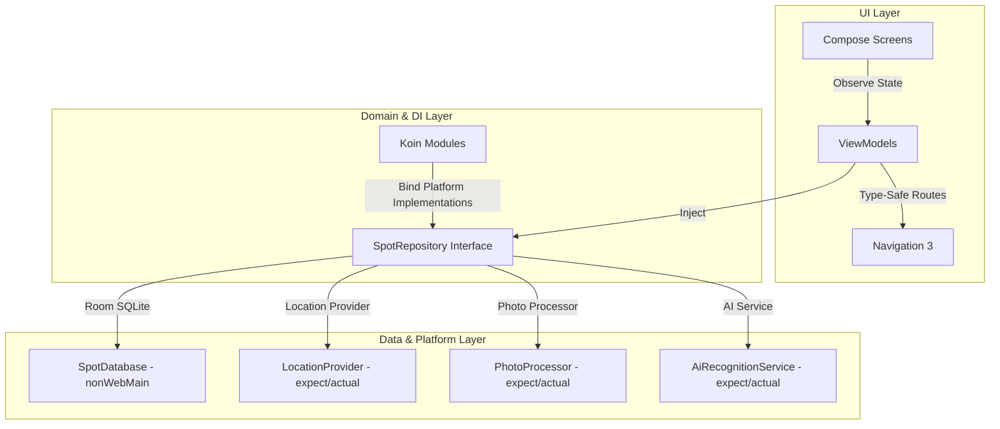
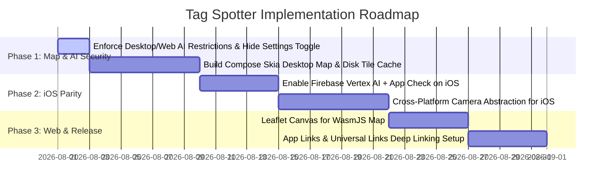

# Tag Spotter - Comprehensive Project Assessment & Technical Review

**Date**: July 2026  
**Project**: Tag Spotter (`net.maiatoday.tagspotter`)  
**Architecture**: Kotlin Multiplatform (KMP) + Compose Multiplatform  
**Platforms**: Android, iOS, Desktop (JVM), Web (WasmJS), Wear OS  

---

## Executive Summary

**Tag Spotter** is a multiplatform urban street art and tag documentation application. The project has evolved from a monolithic Android prototype into a modularized **Kotlin Multiplatform (KMP)** codebase supporting five target environments: **Android, iOS, Desktop (JVM), Web (WasmJS), and Wear OS**.

The codebase demonstrates high software engineering standards: a domain-driven **core / feature** multi-module structure, dependency injection via **Koin 4.x**, type-safe **Navigation 3**, local-first **Room KMP** persistence (on non-web platforms), and lifecycle-aware Compose UI state management (`collectAsStateWithLifecycle`).

Following an in-depth codebase audit, backlog review, and interactive `/grill-me` technical design alignment session, a concrete implementation roadmap has been established for **Desktop Map Optimization** and **Multiplatform AI Key Security**.

---

## 1. Libraries & Dependency Summary

The project leverages modern KMP libraries configured through Gradle Version Catalog (`gradle/libs.versions.toml`).

| Category | Primary Library | Version | Usage & Role |
| :--- | :--- | :--- | :--- |
| **Language & Concurrency** | Kotlin | `2.4.0` | Core language and compiler |
| | Kotlinx Coroutines | `1.11.0` | Asynchronous programming & structured concurrency |
| | Kotlinx Serialization | `1.11.0` | JSON serialization for type-safe routes & data exchange |
| **UI Framework** | Compose Multiplatform | `1.11.1` | Declarative UI across Android, iOS, Desktop, and Web |
| | AndroidX Compose BOM | `2026.05.01` | Material 3 & UI primitives |
| **Navigation** | Navigation 3 (KMP) | `1.1.2` / `1.1.1` | Type-safe Kotlinx Serialization navigation routing |
| **Dependency Injection** | Koin | `4.2.1` | KMP DI framework (`koin-core`, `koin-compose-viewmodel`) |
| **Local Database** | Room KMP (SQLite) | `2.8.4` | SQLite-bundled local database for `nonWeb` targets |
| **Image Loading** | Coil 3 | `3.4.0` | Multiplatform image fetching and caching |
| **Networking** | Ktor | `2.3.12` / `3.0.3` | Multiplatform HTTP client for sync & networking |
| **Location Services** | Google Play Services / CoreLocation | `21.3.0` (Android) | Platform-specific location providers via KMP interfaces |
| **Camera & Photo** | CameraX & ImagePickerKMP | `1.6.1` / `1.0.41` | Live capture on Android & multiplatform photo picking |
| | Ashampoo KIM | `0.26.2` | KMP EXIF metadata parser |
| **Cloud & AI** | Firebase Kotlin SDK & Vertex AI | `2.1.0` / `0.9.0` | Auth, Firestore, Storage, and Gemini Multimodal AI |
| **Wearable** | Wear Compose & Play Wearable | `1.6.2` / `20.0.1` | Wear OS smartwatch UI & phone-to-watch messaging |
| **Code Coverage** | Kotlinx Kover | `0.9.8` | Project-wide code coverage reporting |

---

## 2. Feature Parity Matrix Across Platforms

| Feature | Android | iOS | Desktop (JVM) | Web (WasmJS) | Wear OS |
| :--- | :---: | :---: | :---: | :---: | :---: |
| **Local Database (Room)** | ✅ Full | ✅ Full | ✅ Full | ⚠️ In-Memory Fake | ❌ (Phone Sync) |
| **Interactive Map** | ✅ OSMDroid | ✅ Apple MapKit | ⚠️ Compose Skia (Phase 1)| ⚠️ Leaflet Canvas | ❌ None |
| **Photo Picking** | ✅ PhotoPicker | ✅ Native Picker | ✅ AWT FileDialog | ⚠️ Stubbed | ❌ (Phone Sync) |
| **Live Camera Capture** | ✅ CameraX | ❌ (Picker fallback) | ❌ (Picker fallback) | ❌ None | ❌ None |
| **EXIF Location Extraction**| ✅ Supported | ✅ Supported | ✅ Supported | ⚠️ Limited | ❌ N/A |
| **GPS Location Tracking** | ✅ FusedLocation | ✅ CoreLocation | ⚠️ Fixed/IP Location | ⚠️ Browser Geo | ⚠️ Phone Sync |
| **AI Artist & Style Tagging**| ✅ Firebase Vertex | ✅ Firebase Vertex | ❌ Disabled (Secure)| ❌ Disabled (Secure)| ❌ N/A |
| **Cloud Sync & Google Auth**| ✅ Supported | ✅ Supported | ✅ Supported | ⚠️ Wasm Auth | ❌ N/A |
| **Wear Companion Sync** | ✅ Phone Host | ❌ N/A | ❌ N/A | ❌ N/A | ✅ Watch Client |

---

## 3. Architectural Assessment

---

## 4. Confirmed Architecture Decisions (`/grill-me` Alignment)

### A. Desktop Map Engine Architecture
1. **Platform-Native Hybrid Approach**:
   - **Android**: Retain native **OSMDroid** (`AndroidView`) — battle-tested, keyless offline tile caching.
   - **iOS**: Retain native **Apple MapKit** (`MKMapView` via `UIKitView`) — 100% keyless, hardware-accelerated, native iOS gestures.
   - **Desktop (JVM)**: Replace JavaFX `WebView` / `JFXPanel` with a custom **pure Compose Skia OpenStreetMap tile renderer**.
2. **Tile Provider Policy**:
   - Standard OpenStreetMap tiles (`https://tile.openstreetmap.org/{z}/{x}/{y}.png`).
   - Completely removes any legacy Yandex map URL references.
3. **Desktop Interaction & Caching Features**:
   - In-memory tile cache + local disk tile caching in app data directory.
   - Mouse drag to pan, scroll-wheel to zoom, click to select coordinates, and clickable custom pin markers.

### B. AI Security & Platform Scope
1. **Mobile Platforms (Android & iOS)**: **ENABLED**.
   - Uses `Firebase Vertex AI` with **App Check** verification.
   - Secure, server-verified Gemini multimodal tag/artist suggestions without exposing raw API keys in app packages.
2. **Desktop (JVM) & Web (WasmJS)**: **HARD-DISABLED**.
   - Koin DI explicitly binds `single<AiRecognitionService> { UnsupportedAiRecognitionService() }`.
   - `isAiAugmentationAvailable` in `DetailViewModel` evaluates to `false`, automatically hiding the AI sparkle button and suggestion cards in `DetailScreen`.
   - In `SettingsScreen`, the AI Artist Recognition toggle switch is **completely hidden** when running on Desktop or Web.
   - Prevents any API key theft or reverse-engineering exposure on client binaries and web bundles.

---

## 5. Phased Implementation Roadmap

---

## Conclusion

With the Map Architecture Strategy finalized and the AI Security Policy defined, the project has a clear, actionable roadmap. Moving Desktop from JavaFX `WebView` to a native Compose Skia map renderer eliminates memory bloat and latency, while configuring AI securely via Firebase Vertex AI on mobile and disabling it on Desktop/Web protects API credentials.
