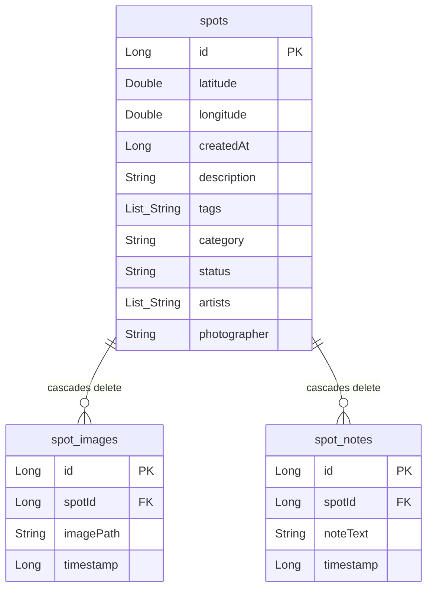
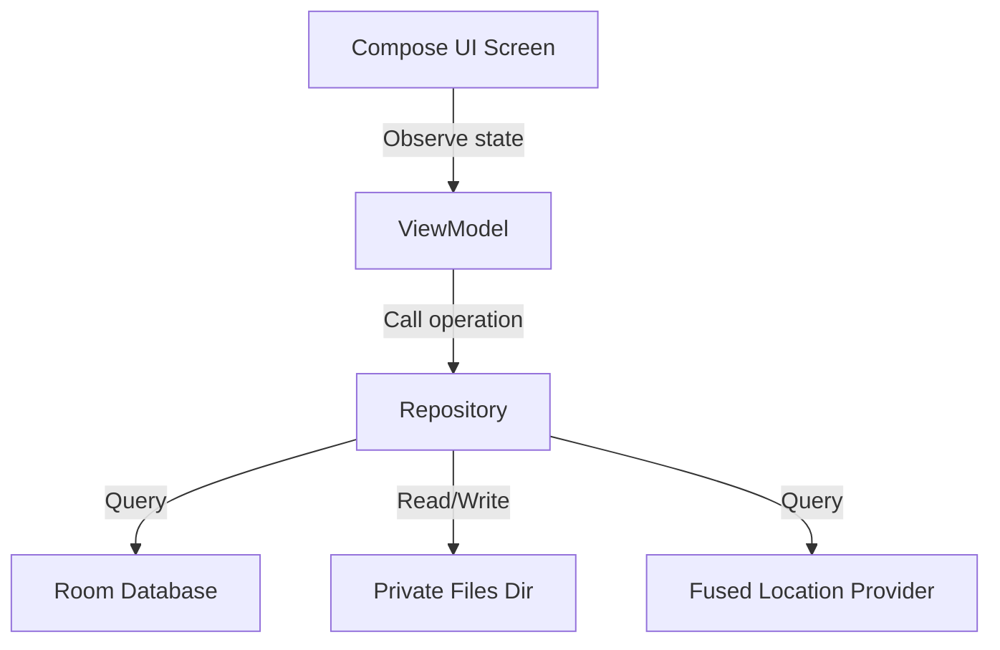

# Project Score Card: Tag Spotter Android App

This document provides a thorough assessment of the **Tag Spotter** Android application codebase against official Android coding standards, modern architecture guidelines, local-first database design, and test coverage, as of May 2026.

---

## 1. Executive Summary

| Category | Score | Status | Key Findings |
| :--- | :---: | :---: | :--- |
| **Architecture & Structure** | **4/10** | ⚠️ Weak | Use of Navigation 3 and clean DB layer, but severe MVVM violations (direct repository calls inside Composables). Unused template code left in codebase. |
| **Kotlin & Android Standards** | **5/10** | ⚠️ Needs Work | Clean Kotlin style, but lacks lifecycle-aware flow collection (`collectAsState` vs `collectAsStateWithLifecycle`) and suffers from critical OSMDroid `MapView` memory leaks. |
| **Database Design (Room)** | **8/10** |  Good | Solid schema definition, cascaded deletes, indexed foreign keys, and migration paths. Minor bugs in type converters and singleton initialization. |
| **Functional Specification Verification** | **6/10** | ⚠️ Partial | Modern photo picker and location logic implemented, but image optimization is completely mocked (does not resize or compress). |
| **Test Coverage** | **0.5/10** | ❌ Deficient | Tests consist of hardcoded template code checking dummy features ("Hello Sample1"). Zero real code or database coverage. |
| **Overall Score** | **4.7/10** | **⚠️ Needs Work** | **The app is a functional prototype but contains critical architectural violations, potential resource leaks, and unoptimized storage that will cause issues in production.** |

---

## 2. Architecture & Design Assessment

### Core Architectural Patterns
Modern Android development recommends the **Guide to App Architecture**, which mandates a separation of concerns, unidirectional data flow (UDF), and lifecycle-aware UI state hosting:
1. **Model-View-ViewModel (MVVM) / Model-View-Intent (MVI) Violations**:
   - **Severe Issue**: The active UI screens—[GalleryScreen](file:///Users/maia/workspace/maiatoday/tag-spotter/app/src/main/java/com/example/tagspotter/ui/screens/GalleryScreen.kt), [MapScreen](file:///Users/maia/workspace/maiatoday/tag-spotter/app/src/main/java/com/example/tagspotter/ui/screens/MapScreen.kt), [DetailScreen](file:///Users/maia/workspace/maiatoday/tag-spotter/app/src/main/java/com/example/tagspotter/ui/DetailScreen.kt), and [TaggingScreen](file:///Users/maia/workspace/maiatoday/tag-spotter/app/src/main/java/com/example/tagspotter/ui/TaggingScreen.kt)—do not use ViewModels at all. 
   - Composables directly access the database via the Repository singleton (`context.applicationContext as TagSpotterApplication`). For example, in `GalleryScreen.kt`:
     ```kotlin
     val app = context.applicationContext as TagSpotterApplication
     val repository = app.repository
     val spots by repository.getSpotsByCategory(selectedCategory).collectAsState(initial = emptyList())
     ```
   - This bypasses the presentation layer entirely. Business logic, state preservation, and asynchronous scopes are tied directly to the Composable lifecycle using `remember`, `LaunchedEffect`, and `rememberCoroutineScope`.
   - **Consequence**: This makes components extremely difficult to unit test and violates separation of concerns. UI code is cluttered with database interactions.

2. **Unused Template Code**:
   - The files [MainScreen.kt](file:///Users/maia/workspace/maiatoday/tag-spotter/app/src/main/java/com/example/tagspotter/ui/main/MainScreen.kt) and [MainScreenViewModel.kt](file:///Users/maia/workspace/maiatoday/tag-spotter/app/src/main/java/com/example/tagspotter/ui/main/MainScreenViewModel.kt) are unused leftovers from a template project structure. They reference a generic `DefaultDataRepository` (defined in [DataRepository.kt](file:///Users/maia/workspace/maiatoday/tag-spotter/app/src/main/java/com/example/tagspotter/data/DataRepository.kt) which just emits `"Android"`).
   - **Consequence**: Codebase pollution and developer confusion.

3. **Dependency Injection**:
   - The project uses manual dependency injection via lazy delegation on the Application class ([TagSpotterApplication.kt](file:///Users/maia/workspace/maiatoday/tag-spotter/app/src/main/java/com/example/tagspotter/TagSpotterApplication.kt)):
     ```kotlin
     val database by lazy { SpotDatabase.getDatabase(this) }
     val repository by lazy { LocalSpotRepository(database.spotDao()) }
     ```
   - For a simple local-first application, manual DI is acceptable. However, as the app expands, migrating to a standard framework like **Hilt** or **Koin** is highly recommended.

4. **Navigation**:
   - **Strength**: The application uses **Navigation 3** (the latest Jetpack navigation generation) combined with Kotlinx Serialization for type-safe routing.
   - Navigation routes and arguments are cleanly defined using `@Serializable` data classes and objects ([NavigationKeys.kt](file:///Users/maia/workspace/maiatoday/tag-spotter/app/src/main/java/com/example/tagspotter/NavigationKeys.kt)). This represents an excellent, state-of-the-art implementation.

---

## 3. Coding Standards & Kotlin Best Practices

### Coroutines and Threading
- **Main Safety**: Data operations and file manipulation should be main-safe (meaning they can be called directly from the main thread without blocking it). In [ImageOptimizer.kt](file:///Users/maia/workspace/maiatoday/tag-spotter/app/src/main/java/com/example/tagspotter/utils/ImageOptimizer.kt), file streaming and copying run synchronously. The caller has to explicitly run it on a background thread (e.g. `scope.launch(Dispatchers.Default)` in `CaptureScreen`). 
- **Recommendation**: Wrap I/O operations inside utility functions with `withContext(Dispatchers.IO)` so that they are guaranteed to be main-safe.

### UI State Collection (Lifecycle Awareness)
- **Lifecycle Leaks**: Flow collection in all composables uses `.collectAsState(initial = ...)` instead of `.collectAsStateWithLifecycle(...)`.
- **Consequence**: Flows (including Room database observation flows) continue active collection even when the app is running in the background. This wastes CPU cycles, increases battery drain, and could trigger unnecessary database re-queries.

### OSMDroid MapView Lifecycle Leaks
- **Critical Resource Leaks**: OpenStreetMap `MapView` requires active lifecycle management. In both `MapScreen.kt` and `DetailScreen.kt`, `MapView` is instantiated inside an `AndroidView` block without calling `mapView.onResume()` and `mapView.onPause()` or releasing overlays when leaving composition.
- **Consequences**:
  - Memory leaks due to map layers holding onto context.
  - Background network threads for fetching map tiles continue running.
- **Recommendation**: Create a custom lifecycle observer in the Composable to forward lifecycle events to the MapView:
  ```kotlin
  val lifecycle = LocalLifecycleOwner.current.lifecycle
  DisposableEffect(lifecycle, mapView) {
      val observer = LifecycleEventObserver { _, event ->
          when (event) {
              Lifecycle.Event.ON_RESUME -> mapView.onResume()
              Lifecycle.Event.ON_PAUSE -> mapView.onPause()
              else -> {}
          }
      }
      lifecycle.addObserver(observer)
      onDispose {
          lifecycle.removeObserver(observer)
          mapView.onDetach() // Prevents memory leaks
      }
  }
  ```

---

## 4. Database Schema Summary & Analysis

The application uses **Room** to manage a local SQLite database containing three tables related through foreign keys.



### Table Definitions

#### 1. `spots`
Main table representing a captured urban spot.
- `id`: `Long` (Primary Key, auto-generated)
- `latitude`: `Double` (GPS coordinate)
- `longitude`: `Double` (GPS coordinate)
- `createdAt`: `Long` (Timestamp in ms)
- `description`: `String` (User notes)
- `tags`: `List<String>` (Stored as text via TypeConverter)
- `category`: `String` (e.g. `"graffiti"`, `"sculpture"`, `"tree"`, `"architecture"`, `"public_place"`)
- `status`: `String` (e.g. `"active"`, `"erased"`)
- `artists`: `List<String>` (Stored as text via TypeConverter)
- `photographer`: `String`

#### 2. `spot_images`
Supports multiple images per spot (e.g., tracking a spot's visual evolution over time).
- `id`: `Long` (Primary Key, auto-generated)
- `spotId`: `Long` (Foreign Key referencing `spots.id` with `onDelete = ForeignKey.CASCADE`)
- `imagePath`: `String` (Absolute file path to the local device storage)
- `timestamp`: `Long` (Capture/Import timestamp)
- *Index*: Indexed on `spotId` for fast join operations.

#### 3. `spot_notes`
Supports adding historical logs or notes to a spot.
- `id`: `Long` (Primary Key, auto-generated)
- `spotId`: `Long` (Foreign Key referencing `spots.id` with `onDelete = ForeignKey.CASCADE`)
- `noteText`: `String`
- `timestamp`: `Long` (Creation timestamp)
- *Index*: Indexed on `spotId`.

### Room & SQLite Schema Assessment
- **Cascade Deletes**: Properly defined on child tables (`spot_images` and `spot_notes`). Deleting a spot automatically cleans up related database entries.
- **Foreign Key Indexing**: Room prints compilation warnings if foreign keys are not indexed because deletes can cause full-table scans. The schema properly indexes the `spotId` columns.
- **Migration Configurations**: The database is currently at version 3. Migrations from 1 -> 2 and 2 -> 3 are explicitly defined:
  - `MIGRATION_1_2`: Adds column `artists` to `spots`.
  - `MIGRATION_2_3`: Adds column `photographer` to `spots`.
  - **Minor Issue**: Migrations are hardcoded to add empty string defaults rather than supporting nullable values, but it's acceptable for local schemas.

> [!WARNING]
> ### 1. Concurrency Bug in Singleton Pattern
> In `SpotDatabase.kt`, the database instance getter is implemented as follows:
> ```kotlin
> fun getDatabase(context: Context): SpotDatabase {
>     return INSTANCE ?: synchronized(this) {
>         val instance = Room.databaseBuilder(...)
>             .addMigrations(MIGRATION_1_2, MIGRATION_2_3)
>             .build()
>         INSTANCE = instance
>         instance
>     }
> }
> ```
> **Issue**: It lacks a second null check (`INSTANCE ?:`) *inside* the `synchronized` block. In concurrent environments, two threads checking `INSTANCE` simultaneously will both enter the block sequentially and compile two separate database instances, overwriting each other.
> **Fix**:
> ```kotlin
> fun getDatabase(context: Context): SpotDatabase {
>     return INSTANCE ?: synchronized(this) {
>         INSTANCE ?: Room.databaseBuilder(...)
>             .addMigrations(MIGRATION_1_2, MIGRATION_2_3)
>             .build().also { INSTANCE = it }
>     }
> }
> ```
>
> ### 2. Fragile TypeConverter Serialization
> Lists of tags and artists are stored using simple comma concatenation:
> ```kotlin
> @TypeConverter
> fun fromStringList(value: List<String>): String = value.joinToString(",")
> 
> @TypeConverter
> fun toStringList(value: String): List<String> {
>     return if (value.isEmpty()) emptyList() else value.split(",")
> }
> ```
> **Issue**: If an artist's name (e.g. `"Banksy, Jr."`) or a tag contains a comma, loading it from the database will split it into two separate items.
> **Fix**: Use JSON serialization (via `kotlinx.serialization` or `Gson`) to serialize lists of strings safely.

---

## 5. Test Coverage Assessment

The application contains two test directories: `androidTest` (instrumented UI tests) and `test` (local JVM unit tests). 

### Analysis of Existing Tests
The current test classes are dummy placeholders created by a generic template generator:
1. **[MainScreenViewModelTest.kt](file:///Users/maia/workspace/maiatoday/tag-spotter/app/src/test/java/com/example/tagspotter/ui/main/MainScreenViewModelTest.kt)**:
   - Sets up a `FakeMyModelRepository` that returns `listOf("Sample")`.
   - Asserts that the UI state is `MainScreenUiState.Loading`.
   - **Verdict**: Irrelevant. The VM and repository under test are not used in the application.
2. **[MainScreenTest.kt](file:///Users/maia/workspace/maiatoday/tag-spotter/app/src/androidTest/java/com/example/tagspotter/ui/main/MainScreenTest.kt)**:
   - Feeds `listOf("Sample1", "Sample2", "Sample3")` to a composable and verifies `Hello Sample1` exists.
   - **Verdict**: Irrelevant. Tests template UI that is not linked to the app's real flow.

### Coverage Gaps
There is **0% test coverage** for the real functionality of the application.
- **Unit Tests**: No tests for `ExifLocationExtractor`, `ImageOptimizer` logic, `LocationHelper`, `SettingsRepository`, or `SpotRepository`.
- **Database Tests**: Room DAO queries (`SpotDao`) have no JUnit test coverage running on an in-memory SQLite database.
- **UI/Integration Tests**: No compose tests verify that Gallery, Map, Settings, or Tagging screens render correctly, display list items, or fire navigation actions.

---

## 6. Functional Specification Discrepancies

### Image Optimization Mocked
The product specifications in `project_brief.md` state:
> **Image Storage & Optimization:** Images are automatically scaled down to a maximum boundary of 1080p and compressed as JPEGs (80% quality) to save device space (reducing file sizes to ~300KB).

However, in [ImageOptimizer.kt](file:///Users/maia/workspace/maiatoday/tag-spotter/app/src/main/java/com/example/tagspotter/utils/ImageOptimizer.kt), the optimization is completely missing:
```kotlin
fun optimizeAndSaveImage(context: Context, sourceFile: File): String? {
    return try {
        val destinationFile = File(context.filesDir, "spot_${UUID.randomUUID()}.jpg")
        sourceFile.inputStream().use { inputStream ->
            destinationFile.outputStream().use { outputStream ->
                inputStream.copyTo(outputStream) // ❌ Direct byte copy, no scaling or compression
            }
        }
        destinationFile.absolutePath
...
```
- **Consequence**: Standard photos captured or picked from the gallery (usually 5MB to 15MB) are stored raw in the app's private files folder. This violates the functional spec and will rapidly deplete user device space.

---

## 7. Recommendations for Refactoring



To align the project with standard Android documentation, the following roadmap is recommended:

1. **Introduce ViewModels**:
   - Create distinct ViewModels for the active flows (e.g. `GalleryViewModel`, `MapViewModel`, `DetailViewModel`, `TaggingViewModel`).
   - Migrate state hosting (like input fields, list collections, load states) from `rememberSaveable` to VM `StateFlow` structures.
   - Ensure the composable UI screens only depend on `StateFlow` representations of the UI state and user event callbacks.

2. **Migrate to Lifecycle-Aware State Collection**:
   - In all composables, change `.collectAsState()` to `.collectAsStateWithLifecycle()`.

3. **Resolve OSMDroid Lifecycle Resource Leaks**:
   - Wrap OSMDroid's MapView setup with a `DisposableEffect` that coordinates with the Android Lifecycle, ensuring `onResume()` / `onPause()` / `onDetach()` are called.

4. **Implement Real Image Compression**:
   - Rewrite `ImageOptimizer` to load bitmaps using `BitmapFactory` options (using `inSampleSize` to sub-sample to 1080p bounds) and write them out using `Bitmap.compress(Bitmap.CompressFormat.JPEG, 80, outputStream)`. Run this I/O on `Dispatchers.IO`.

5. **Enhance Database Serializers**:
   - Replace the fragile comma split TypeConverters with a Kotlinx Serialization JSON converter to safely serialize List properties.

6. **Establish Actual Test Suite**:
   - Write Room DB test cases in `androidTest` using an in-memory database helper (`Room.inMemoryDatabaseBuilder`).
   - Write local JVM tests for `SpotRepository` and `ImageOptimizer` using fake storage/locations.
   - Implement Compose UI tests using `createComposeRule` to mock navigation and check screen elements.
